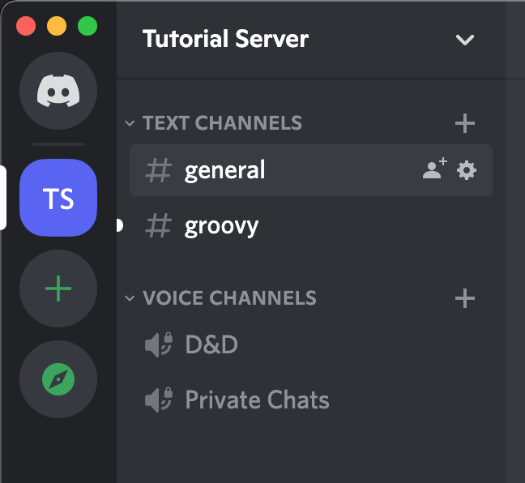
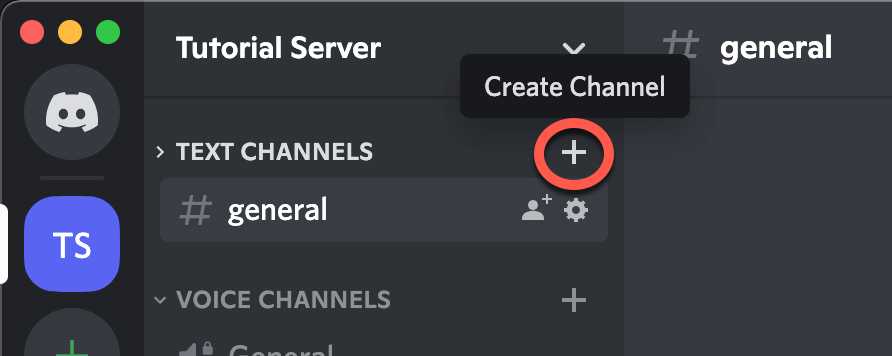
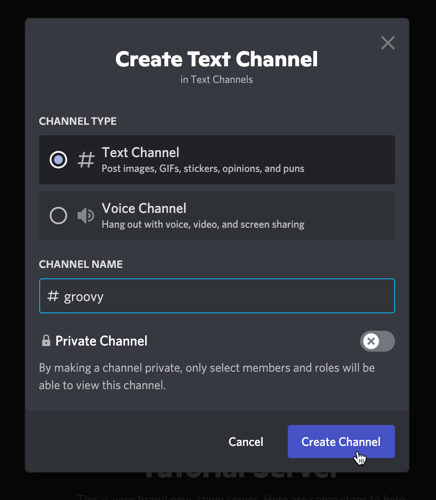
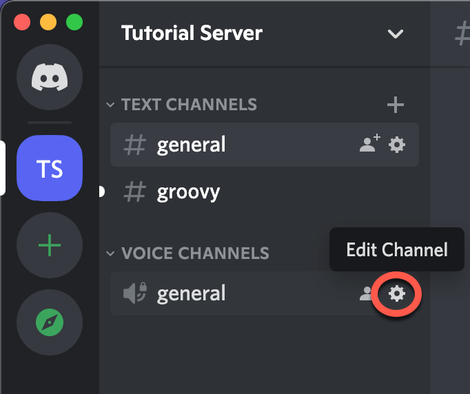
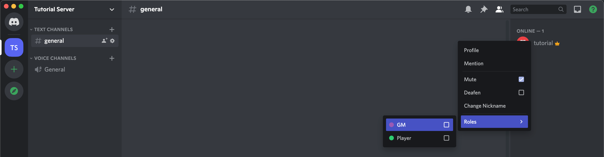
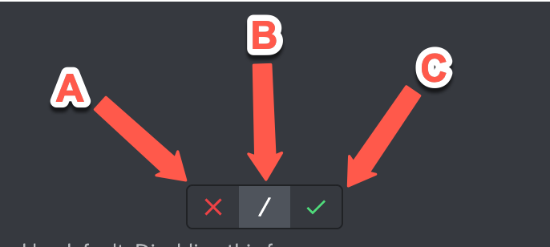
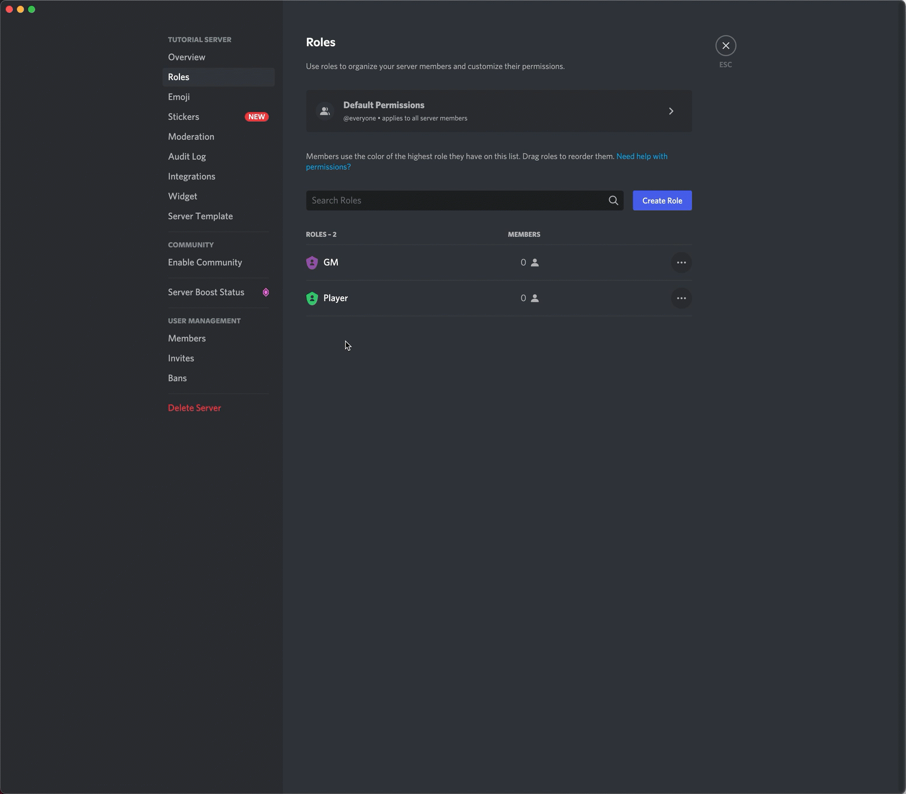
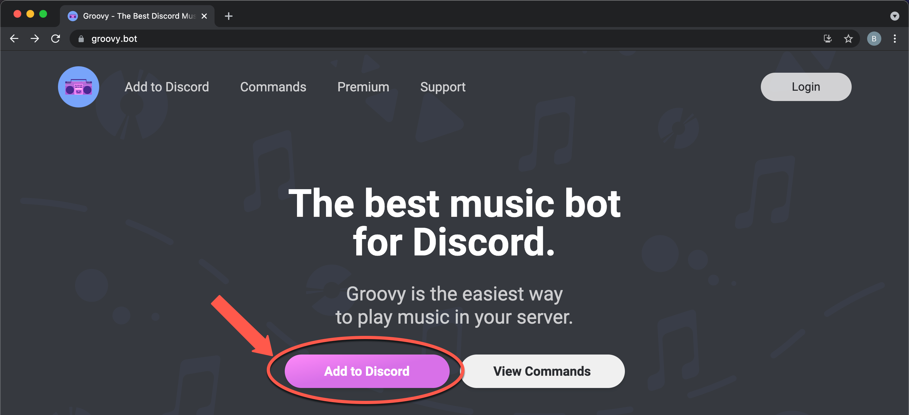
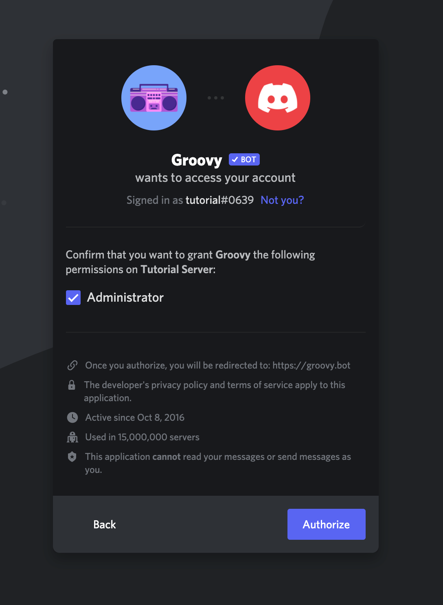

# Discord Setup for Dungeons & Dragons

## Contents
- [Introduction](#introduction)
- [Prerequisites](#prerequisites)
- [1. Create Your Server](#serverCreation)
- [2. Create Your Channels](#createChannelsSection)
  - [2.1. Creating Channels](#createChannels)
  - [2.2. Renaming Channels](#renameChannels)
- [3. Create User Roles and Configure Permissions](#createRoles)
  - [3.1. Managing Roles](#roles)
  - [3.2. Configuring Server Permissions](#serverPermissions)
- [4. Get Your Music Bot](#getYourMusicBot)
  - [4.1. Inviting Groovy Bot](#invitingGroovy)
  - [4.2. Configuring Groovy Bot](#configuringGroovy)
  - [4.3. Using Groovy Bot](#usingGroovy)
- [5. Keep Going!](#nextSteps)

## Introduction 

If you're a game master (GM) and you're running tabletop roleplaying games (TTRPGs)
virtually, you need a Discord server. Discord is the most popular tool in the TTRPG
space for hosting a gaming community, or even a fanbase. Though some of its essential
features can be found on virtual tabletops (VTTs), such as Roll20, both Discord's
UI and the quality of its services are superior to what is offered by available
VTTs. It's also much more convenient for your community to interact through Discord
than through a VTT or other chat-focused apps like Zoom or Teams.

Discord servers are free spaces that provide text, voice, and video chat features.
This guide will help you quickly create a well organized, ready-to-scale,
invite-only server that will have a music bot, which you can use to add atmosphere to your
games. By the end, you'll also be familiar with all of the essential Discord features.

**Note:** This is a quick, practical tutorial. It does not discuss the features of Discord in depth.
However, it does touch on a few gotchas so you won't be caught off guard in the middle of a game.

First, we'll create your server. Second, we'll create a new text channel specifically
for communicating with your music bot. Then, we'll create some user roles for GMs and Players. Once we have those,
we'll configure server-wide and channel-specific permissions for those roles. That
will give your server some structure. In the last section, you'll find a recommendation
for a dice rolling bot!

This will take about 25 minutes. Let's get going!

## Prerequisites 

You need to have the Discord app installed, and you need to have a Discord account.
For assistance with either of those steps, consult Discord's guide to [Getting Started](https://support.discord.com/hc/en-us/articles/360033931551-Getting-Started). That process will only take a few minutes.

System requirements can be found [here](https://support.discord.com/hc/en-us/articles/213491697-What-are-the-OS-system-requirements-for-Discord-). (You'll need about 65 MB of available hard drive space.)

If you're configuring a server that you don't own, you'll need the *Manage Server*
permission on that server. Otherwise, no experience with Discord beyond installation
and account creation is necessary.

## 1. Create Your Server 

Time to create your server! This is where you will be hosting your games. It'll
be a bit lonely at first, but soon it will be full of friends!

**Follow these steps** to create your server:
<ol>
  <li>
    Click on the <em>Add a Server</em> button, represented by a plus icon on left-side menu bar.
  </li>
  <li>
    Select <em>Create My Own.</em>
  </li>
  <li>
    Select <em>For me and my friends.</em>
    <ul>
      <li>
        Don't worry about server templates for now. They won't help with what we're doing.
      </li>
    </ul>
  </li>
  <li>
    Enter a name for your server, and click <em>Create.</em>
  </li>
</ol>

**Fig. 1.1** shows what that process looks like.

  
   
  <b>Fig. 1.1 - Server Creation</b>

## 2. Create Your Channels 

Now, let's create two new channels for your server. You'll want a dedicated text
channel to communicate with your music bot. You'll also want a second voice channel
(these also have video chat capabilities) so you can pull players aside for private
chats during games.

<b>Fig. 2.1</b> shows what you'll see when you're done!

  
   
  <b>Fig. 2.1 - New Channels Example</b>

### 2.1. Creating Channels 

**Follow these steps** to create your new channels:
<ol>
  <li>
    To the right of <em>TEXT CHANNELS</em>, click on the plus icon - see <b>Fig. 2.1.1</b>.
  </li>
  <li>
    When you see the <em>Create Text Channel</em> popup, enter a name for your server, then click <em>Create Channel</em> - see <b>Fig. 2.1.2</b>.
    <ul>
      <li>
        Ensure that <em>Private Channel</em> is <b>unchecked</b>.
      </li>
    </ul>
  </li>
  <li>
    Repeat this process to create a new voice channel for private chats with players during games.
  </li>
</ol>

      
       
      <b>Fig. 2.1.1 - Create Channel Button</b>

      
       
      <b>Fig. 2.1.2 - Create Channel Popup</b>

### 2.2. Renaming Channels 

Because this is a gaming server, let's rename the <em>general</em> voice channel
to better fit that theme.

**Follow these steps** to rename a channel:
<ol>
  <li>
    Click on the gear icon to the right of the channel name, which will take you to the channel's settings page - see <b>Fig. 2.2.1</b>.
  </li>
  <li>
    Change the server's name.
  </li>
  <li>
    Click on the green <em>Save Changes</em> button, which will appear at the bottom of the page.
  </li>
</ol>

  
   
  <b>Fig. 2.2.1 - Edit Channel Button</b>

## 3. Create User Roles and Configure Permissions 

In this section, you'll create a role for GMs and one for players. After that,
you'll configure permissions for each role.

As you scale your community and add more features to your server, you'll need
more complex roles and permissions, but this guide focuses on the basics.

### 3.1. Managing Roles 

Roles are profiles that server admins (you) assign to users. A user may have many
roles. They are essential to maintaining a well-organized and stable server.

#### 3.1.1. Creating Roles

Let's create the "GM" role first.

**Follow these steps** to create your new roles:
<ol>
  <li>
    Navigate to "Server Settings".
  </li>
  <li>
    Select "Roles" from the side menu.
  </li>
  <li>
    Click "Create Role"
  </li>
  <li>
    Enter the role name and select a color for the role. (The color is a purely aesthetic element of the role.)
  </li>
  <li>
    Skip the "setup permissions" and "add members" steps. We'll do that stuff later.
  </li>
</ol>

**Fig.** shows what that process looks like.

  
   
  <b>Fig. 3.1.1.1 - Role Creation</b>

Repeat the previous steps to create a "Player" role.

#### 3.1.2 Assigning Roles

Now, assign the "GM" role to yourself.

Right click on a user's name and navigate to the roles options.

**Follow these steps** to assign roles:
<ol>
  <li>
    Choose a user to assign roles to.
  </li>
  <li>
    Right click on their name and open the "Roles" menu.
  </li>
  <li>
    Click the checkbox for each role you want to give the user.
  </li>
</ol>

**Fig. 3.1.2.1.** shows the "Roles" menu.

  
   
  <b>Fig. 3.1.2.1 - Assign Roles</b>

### 3.2. Configuring Server Permissions 

Permissions define what users are allowed to do in your server and its channels.
There are server-wide permissions and channel-specific permissions. Channel-specific
permissions will override server permissions if they conflict. Permissions are
attached to roles.

For now, you don't need to know what each permission does. Basically, players
need to view your channels and speak in them. GMs need to speak over or mute
players, move players around channels, and even kick or ban players.

Ensure that your players and GMs can do those things by [copying these GM and player permissions](https://github.com/brohlf/technical-writing-portfolio/blob/main/Discord%20Setup%20Tutorial/Permission%20Configurations/gm-player-configs.md).

Channel permissions override server permissions, but they take effect only in the
server for which they are configured. You will see a list of permissions, each with
an "x", a slash, and a check next to them. Here's what they mean:

- A: explicitly deny this permission for this channel (override server permission)
- B: inherit server permission
- C: explicitly allow this permission for this channel (override server permission)

  
   
  <b>Fig. 4.2.2 - Channel Permission Explanation</b>

**Note:** as the owner of the server, you always have all permissions.

**Follow these steps** to find the permissions for a particular role:
<ol>
  <li>
    Navigate to "Roles" in "Server Settings".
  </li>
  <li>
    Select the role for which you want to configure permissions.
  </li>
  <li>
    Select the "Permissions" tab, located at the top of the page in the middle.
  </li>
  <li>
    Configure permissions for the role and click save, located at the bottom
    of the page.
  </li>
</ol>

**Fig. 3.2.1** shows what that process looks like.

  
   
  <b>Fig. 3.2.1 - Navigate Permissions</b>

A more detailed discussion of permissions can be found [here](https://support.discord.com/hc/en-us/articles/206141927-How-is-the-permission-hierarchy-structured-)

## 4. Get Your Music Bot 

Music support found on VTTs is inconsistent; so if you want music in your game,
you should have a music bot as a backup. Music bots work by joining your voice
or video chats and stream music through audio.

Groovy bot is one of the most popular music bots for Discord.

We will confine Groovy to a single channel so that it won't clutter your player's
chat. You also might not want players controlling it. DMs should have exclusive
control over the music in their games. So we'll make sure of that.

### 4.1. Inviting Groovy Bot 

Just like users, bots need to be invited to your server.

**Follow these steps** to navigate to invite Groovy to your server:

1. Find Groovy bot.

    Navigate to the home page of [Groovy Bot](https://groovy.bot/), and click
    "Add to Discord", shown in Fig. 4.1.1.

    

      
       
      <b>Fig. 4.1.1 - Add To Discord Button</b>
    

    This will navigate you to a panel that contains a dropdown menu titled "ADD TO
    SERVER." Select your server name and click continue. You may also need to login.

1. Invite Groovy bot.

    At this point, you should see this panel. You need to grant admin privileges so
    that Groovy can create a role for itself. (But, once it's done that, you should
    revoke admin privileges.) Click "Authorize."

    

      
       
      <b>Fig. 4.1.2 - Grant Admin Privileges</b>
    

    </li>

Now, you should see a new member in your chat! That is groovy bot.

### 4.2 Configuring Groovy Bot 

Now that Groovy is in your server, we want to remove its admin privileges and
create a channel dedicated to it (and also, in the future, to other bots).

**Follow these steps** to navigate to configure Groovy:

1. Find the Groovy role.

    Navigate to your list of server roles in server settings. You should see a
    new role for Groovy.

1. Configure server permissions for the "Groovy" role.

    Navigate to the permissions tabs for the "Groovy" role and configure its
    permissions to match the [following](https://github.com/brohlf/technical-writing-portfolio/blob/main/Discord%20Setup%20Tutorial/Permission%20Configurations/groovy-configs.md).

1. Configure channel permissions for the "Groovy" role.

    Now let's restrict Groovy from seeing anything that happens in the "general"
    text channel.

    1. Click the "general" channel's gear icon to "Edit Channel".

    1. Add the "Groovy" role to the list of roles tracked by this channel.

        At first, you should only see the "@Everyone" role.

    1. Deny all permissions to "Groovy" channel.

1. Configure "Player" role permissions in the "groovy Channel".

    1. Navigate to the "groovy" "Edit Channel" page.

    1. Give the "Player" role permission to view the channel and to read text
    history in the Groovy channel.

**Fig 4.2.1.** shows what that process looks like.

  
   
  <b>Fig. 4.2.1 - Navigate Channel Permissions</b>

### 4.3 Using Groovy Bot 

See a complete list of [Groovy Commands](https://groovy.bot/commands).

Most likely, you're most frequently used commands will be "/play", "/pause",
"/unpause", and "/clear".

**Note:** after you pause the bot, to start the music again, use "/unpause".
Using "/play" will restart the music from the beginning of the playlist.

## 5. Keep Going! 

As cool as Groovy is, you will eventually want to get some of your real friends
into the server. If you need some help with that, follow this short guide to
inviting your friends: [inviting friends](https://support.discord.com/hc/en-us/articles/204155938-How-do-I-invite-friends-to-my-server-)

Groovy isn't the only helpful bot! If you aren't using a VTT, but you need a way
to roll dice, you can do that right in your server. Invite the "Avrae" bot and
create another channel for dice rolling.

As your community grows, you will need to add more roles, more bots to moderate
your users, and more channels.
